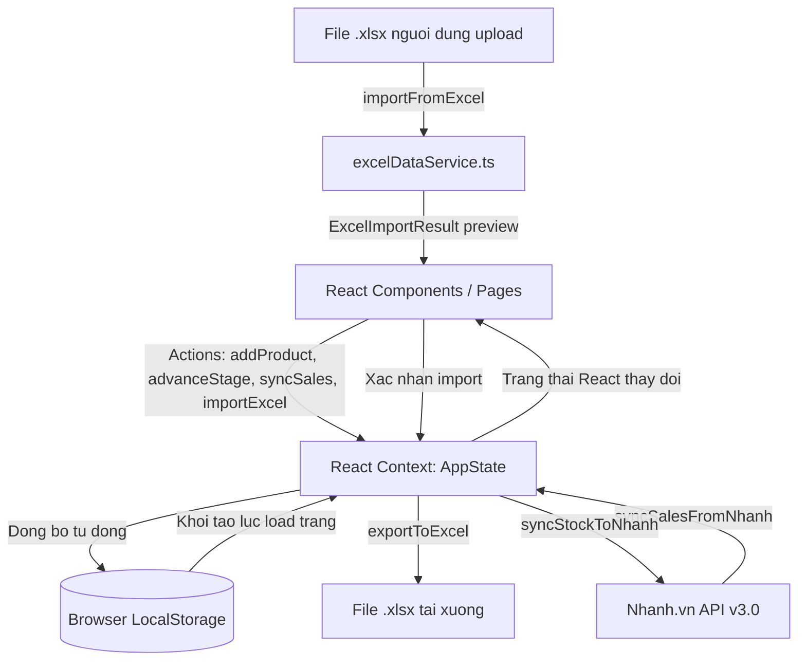

# Kien truc ung dung - Silence Production Dashboard

Tai lieu nay mo ta chi tiet kien truc client-side, cach quan ly du lieu (state) va luong hoat dong cua ung dung **Silence Production Dashboard**.

---

## Tong quan Kien truc (Vite + React SPA)

Ung dung duoc xay dung duoi dang Single Page Application (SPA) chay hoan toan tren trinh duyet cua nguoi dung. De phuc vu viec thu nghiem nhanh va luu tru ben vung, chung ta ket hop **React Context API** va **HTML5 LocalStorage**.



---

## Cau truc cac thanh phan (Component Hierarchy)

```text
src/
+-- main.tsx                      # Diem khoi dau (Entrypoint)
+-- App.tsx                       # Quan ly routing va Layout chinh
+-- context/
|   +-- AppContext.tsx            # Quan ly State tap trung (Context + Reducer)
+-- services/
|   +-- nhanhService.ts           # Ket noi API Nhanh.vn v3.0 (doc lap, giu nguyen)
|   +-- nhanhDataMapper.ts        # Map du lieu Nhanh.vn -> kieu noi bo
|   +-- excelDataService.ts       # [MOI] Doc/ghi file Excel (.xlsx) qua SheetJS
|   +-- productionDataService.ts  # KPI san xuat, export/import JSON
+-- components/
|   +-- Sidebar.tsx               # Thanh dieu huong trai (240px)
|   +-- Header.tsx                # Tieu de trang, nut Sync trang thai
|   +-- DashboardCharts.tsx       # Bieu do SVG/Recharts tuy chinh
+-- pages/
    +-- Dashboard.tsx             # Phan tich tai chinh, thong ke KPI
    +-- Production.tsx            # Bang dieu khien tien do san xuat 5 buoc
    +-- Expenses.tsx              # Nhap chi phi nhanh & dong bo don hang
    +-- Inventory.tsx             # Quan ly ton kho kha dung/dang SX/da ban
    +-- Products.tsx              # Quan ly danh muc san pham (SKU)
    +-- Forecast.tsx              # Du bao goi hang / san xuat
    +-- Settings.tsx              # Cau hinh API, quan ly du lieu, Excel import/export
```

---

## Quan ly trang thai (State Management)

Toan bo du lieu cua he thong duoc quan ly thong qua `AppContext` chua cac tap du lieu sau:
- **`products`**: Danh sach san pham kha dung trong he thong.
- **`productionBatches`**: Danh sach cac lo hang dang hoac da san xuat, kem theo trang thai cong doan hien tai.
- **`expenses`**: Cac khoan chi phi van hanh nhap them.
- **`sales`**: Cac don hang ban (duoc tao thu cong hoac dong bo tu kenh ban le).

### Quy trinh cap nhat du lieu (Data Update Flow)
1. Nguoi dung thuc hien mot hanh dong (vi du: chuyen trang thai lo hang san xuat sang "Dong goi & Nhap kho").
2. Component goi ham dispatch cua Context: `advanceBatchStage(batchId)`.
3. State cua lo hang chuyen sang trang thai moi. Dong thoi, so luong ton kho `Available` cua san pham do duoc cong them.
4. Trang thai moi duoc ghi de vao `LocalStorage`.
5. React render lai giao dien, cac bieu do tu dong cap nhat so lieu moi nhat.
6. Tu dong keo don hang tu san Thuong mai dien tu (Nhanh.vn API) ve dinh ky moi 5 phut khi o che do Live.
7. Ho tro cap nhat du lieu hang loat qua file Excel (toan bo SKU cung luc).
8. Tinh toan lai lo dua tren chi phi va doanh thu theo tung ngay, tuan, thang.

---

## Luong cap nhat du lieu qua Excel

Tinh nang nay cho phep cap nhat du lieu **offline** ma khong can ket noi Nhanh.vn API.

```
1. User tai Template Excel (.xlsx) tu Settings
      |
      v
2. Dien du lieu vao 4 sheet: Products | Sales | Expenses | ProductionBatches
      |
      v
3. Upload file --> excelDataService.importFromExcel(file)
      |
      v
4. Validate tung dong, sinh ExcelImportResult (co warnings)
      |
      v
5. UI hien preview: so dong doc duoc + danh sach canh bao
      |
      v
6. User chon che do: GHI DE (xoa data cu) | THEM MOI (giu data cu)
      |
      v
7. Xac nhan --> importAllData() --> LocalStorage cap nhat --> UI render lai
```

**Tach biet voi Nhanh.vn:** `excelDataService.ts` hoan toan doc lap voi `nhanhService.ts`.
Khi co ket noi Nhanh.vn tro lai, chi can goi lai cac ham sync ma khong xung dot du lieu.

---

## Cac kieu du lieu chinh (Type System)

| Type | Mo ta |
|------|-------|
| `Product` | San pham: sku, name, defaultCost, defaultPrice, nhanhStock |
| `ProductionBatch` | Lo san xuat: id, items[], currentStage, status, targetDate |
| `Sale` | Don hang: id, productSku, quantity, unitPrice, saleDate, source |
| `Expense` | Chi phi: id, category, amount, expenseDate, notes |
| `ExcelImportResult` | [MOI] Ket qua parse Excel: products[], sales[], expenses[], batches[], warnings[] |
| `ExcelImportMode` | [MOI] Che do import: overwrite hoac append |
