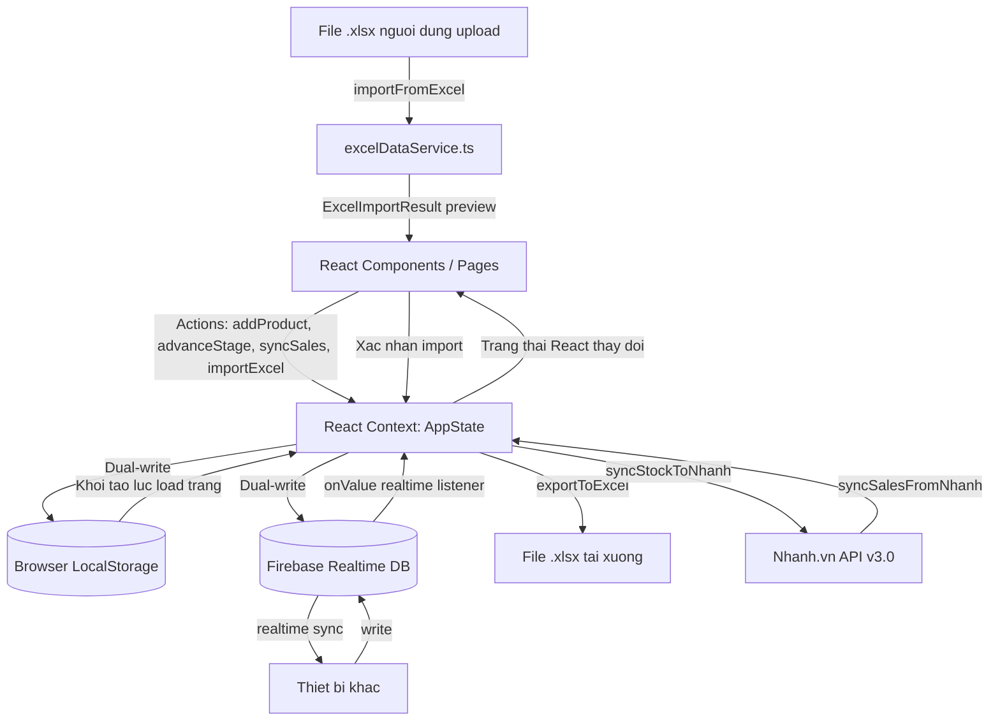
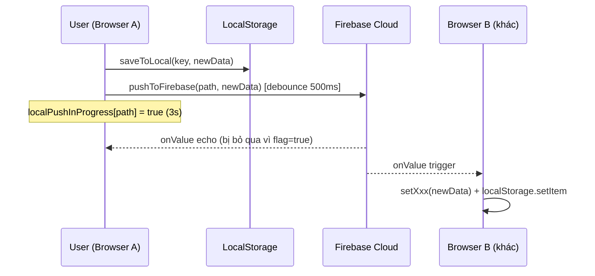
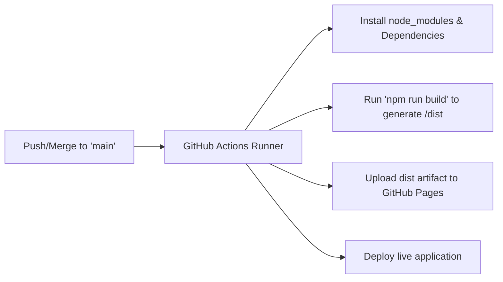

# Kien truc ung dung - Silence Production Dashboard

Tai lieu nay mo ta chi tiet kien truc client-side, cach quan ly du lieu (state) va luong hoat dong cua ung dung **Silence Production Dashboard**.

---

## Tong quan Kien truc (Vite + React SPA)

Ung dung duoc xay dung duoi dang Single Page Application (SPA) chay hoan toan tren trinh duyet cua nguoi dung. Ket hop **React Context API**, **HTML5 LocalStorage** va **Firebase Realtime Database** de dong bo du lieu giua cac thiet bi.



---

## Cau truc cac thanh phan (Component Hierarchy)

```text
src/
+-- main.tsx                      # Diem khoi dau (Entrypoint)
+-- App.tsx                       # Quan ly routing va Layout chinh
+-- context/
|   +-- AppContext.tsx            # Quan ly State tap trung (Context + Reducer)
+-- services/
|   +-- nhanhService.ts           # Ket noi API Nhanh.vn v3.0 (doc lap, giu nguyen)
|   +-- nhanhDataMapper.ts        # Map du lieu Nhanh.vn -> kieu noi bo
|   +-- excelDataService.ts       # [MOI] Doc/ghi file Excel (.xlsx) qua SheetJS
|   +-- productionDataService.ts  # KPI san xuat, export/import JSON
|   +-- firebaseConfig.ts         # [MOI] Khoi tao Firebase App + Realtime Database
|   +-- firebaseSyncService.ts    # [MOI] Push/listen/debounce dong bo Cloud
+-- components/
|   +-- Sidebar.tsx               # Thanh dieu huong trai (240px)
|   +-- Header.tsx                # Tieu de trang, nut Sync trang thai
|   +-- DashboardCharts.tsx       # Bieu do SVG/Recharts tuy chinh
+-- pages/
    +-- Dashboard.tsx             # Phan tich tai chinh, thong ke KPI
    +-- Production.tsx            # Bang dieu khien tien do san xuat 5 buoc
    +-- Expenses.tsx              # Nhap chi phi nhanh & dong bo don hang
    +-- Inventory.tsx             # Quan ly ton kho kha dung/dang SX/da ban
    +-- Products.tsx              # Quan ly danh muc san pham (SKU)
    +-- Forecast.tsx              # Du bao goi hang / san xuat
    +-- Settings.tsx              # Cau hinh API, quan ly du lieu, Excel import/export
```

---

## Quan ly trang thai (State Management)

Toan bo du lieu cua he thong duoc quan ly thong qua `AppContext` chua cac tap du lieu sau:
- **`products`**: Danh sach san pham kha dung trong he thong.
- **`productionBatches`**: Danh sach cac lo hang dang hoac da san xuat, kem theo trang thai cong doan hien tai.
- **`expenses`**: Cac khoan chi phi van hanh nhap them.
- **`sales`**: Cac don hang ban (duoc tao thu cong hoac dong bo tu kenh ban le).

### Quy trinh cap nhat du lieu (Data Update Flow)
1. Nguoi dung thuc hien mot hanh dong (vi du: chuyen trang thai lo hang san xuat sang "Dong goi & Nhap kho").
2. Component goi ham dispatch cua Context: `advanceBatchStage(batchId)`.
3. State cua lo hang chuyen sang trang thai moi. Dong thoi, so luong ton kho `Available` cua san pham do duoc cong them.
4. Trang thai moi duoc ghi de vao `LocalStorage`.
5. React render lai giao dien, cac bieu do tu dong cap nhat so lieu moi nhat.
6. Tu dong keo don hang tu san Thuong mai dien tu (Nhanh.vn API) ve dinh ky moi 5 phut khi o che do Live.
7. Ho tro cap nhat du lieu hang loat qua file Excel (toan bo SKU cung luc).
8. Tinh toan lai lo dua tren chi phi va doanh thu theo tung ngay, tuan, thang.

---

## Luan cap nhat du lieu qua Excel

Tinh nang nay cho phep cap nhat du lieu **offline** ma khong can ket noi Nhanh.vn API.

```
1. User truy cập trực tiếp trang nghiệp vụ (Products, Production, Expenses, Inventory, Forecast)
      |
      v
2. Tải template mẫu riêng của trang đó, hoặc xuất danh sách hiện tại ra Excel (.xlsx)
      |
      v
3. Sửa đổi thông tin ngoại tuyến và tải lên tại chính trang đó
      |
      v
4. Hệ thống gọi `excelDataService.importFromExcel(file)` để parse và validate dữ liệu
      |
      v
5. Hiển thị modal preview số dòng đọc được kèm cảnh báo (nếu có)
      |
      v
6. Chọn chế độ cập nhật: Ghi đè (Overwrite) hoặc Thêm mới (Append)
      |
      v
7. Xác nhận -> gọi `importAllData()`:
      - setProducts/setSales/... cập nhật React state
      - saveToLocal() ghi vào LocalStorage
      - pushToFirebase() [debounce 500ms] đẩy lên Firebase cloud
            |
            | ** QUAN TRỌNG: pushToFirebase() đánh dấu localPushInProgress[path] = true
            | ** Firebase listener sẽ BỎ QUA echo trong 3 giây tiếp theo
            | ** để tránh race condition ghi đè dữ liệu mới
            v
8. Sau 3000ms: window.location.reload() để refresh UI
      (3000ms = 500ms debounce + ~2000ms buffer cho network latency)
```

> [!IMPORTANT]
> **Tại sao timeout reload phải là 3000ms (không được giảm xuống)?**
> Firebase `pushToFirebase()` có debounce 500ms trước khi push. Nếu reload xảy ra trước khi Firebase push hoàn tất, sau khi reload Firebase listener sẽ nhận lại data cũ từ cloud và ghi đè LocalStorage → mất dữ liệu mới vừa import.

**Tach biet voi Nhanh.vn:** `excelDataService.ts` hoan toan doc lap voi `nhanhService.ts`.
Khi co ket noi Nhanh.vn tro lai, chi can goi lai cac ham sync ma khong xung dot du lieu.

---

## Co che dong bo Firebase (Firebase Sync Architecture)

Firebase Realtime Database duoc su dung de dong bo du lieu giua cac thiet bi theo thoi gian thuc.

### Dual-write Pattern

Moi thay doi du lieu tren local deu duoc ghi vai hai noi song song:

```
User Action
    |
    v
setXxx(newData)          ← Cập nhật React state ngay lập tức
    |
    v
saveToLocal(key, data)
    ├── localStorage.setItem(key, JSON.stringify(data))
    └── pushToFirebase(path, data)   ← debounce 500ms, sau đó push lên cloud
```

### Echo Suppression — Tranh vong lap ghi de

Firebase `onValue` listener fire **ngay ca khi chinh client do vua push data**. De tranh listener nhan "echo" va ghi de du lieu moi bang du lieu cu tu cloud, he thong su dung co che **Local Push Suppression**:

```
pushToFirebase(path, data) duoc goi
    |
    ├── localPushInProgress[path] = true   ← Danh dau dang push
    |   (tu dong reset ve false sau 3000ms)
    |
    └── [debounce 500ms] → push len Firebase cloud
            |
            v
Firebase onValue listener nhan event
    |
    ├── if isLocalPushInProgress(path) === true
    |       └── BỎ QUA (skip) — day la echo tu chinh minh
    |
    └── if isLocalPushInProgress(path) === false
            └── Cap nhat state tu thiet bi KHAC — xu ly binh thuong
```

**Cac file lien quan:**
- `firebaseSyncService.ts`: `localPushInProgress`, `isLocalPushInProgress()`, `pushToFirebase()`
- `AppContext.tsx`: Kiem tra `!isLocalPushInProgress(path)` truoc khi xu ly Firebase listener callback

### Chu ki song cua du lieu (Data Lifecycle)



---

## Cac kieu du lieu chinh (Type System)

| Type | Mo ta |
|------|-------|
| `Product` | San pham: sku, name, defaultCost, defaultPrice, nhanhStock |
| `ProductionBatch` | Lo san xuat: id, items[], currentStage, status, targetDate |
| `Sale` | Don hang: id, productSku, quantity, unitPrice, saleDate, source |
| `Expense` | Chi phi: id, category, amount, expenseDate, notes |
| `ExcelImportResult` | [MOI] Ket qua parse Excel: products[], sales[], expenses[], batches[], warnings[] |
| `ExcelImportMode` | [MOI] Che do import: overwrite hoac append |

---

## Luu y & Cac bug da biet (Known Gotchas)

Ghi nhan cac van de da gap de tranh lap lai trong tuong lai.

### ❌ Bug: Import Excel khong ghi nhan du lieu moi

**Ngay phat hien:** 2026-07-19

**Trieu chung:** Sau khi import Excel thanh cong (hien thi thong bao "✅ Import thanh cong"), khi trang tai lai thi du lieu cu van hien thi, du lieu moi bi mat.

**Nguyen nhan goc re (Root Cause):** Race condition giua Firebase listener va qua trinh push sau import:

1. `importAllData()` ghi du lieu moi vao `localStorage` ✅
2. `pushToFirebase()` debounce 500ms roi push len Firebase
3. **Firebase `onValue` listener nhan "echo"** (hoac data cu tu cloud chua cap nhat kip) va ghi de lai `localStorage` bang du lieu cu ❌
4. `window.location.reload()` xay ra sau 1500ms → app doc `localStorage` da bi ghi de → mat du lieu moi

**Cach sua:**
1. **`firebaseSyncService.ts`**: Them `localPushInProgress` flag. `pushToFirebase()` set `localPushInProgress[path] = true` ngay lap tuc, tu dong reset sau 3000ms.
2. **`AppContext.tsx`**: Them check `!isLocalPushInProgress(path)` trong moi Firebase listener callback. Neu dang push tu local thi bo qua echo.
3. **Tat ca cac page co import**: Tang timeout `window.location.reload()` tu 1500ms len **3000ms** de Firebase push hoan tat truoc khi reload.

> [!CAUTION]
> **Quy tac bat buoc cho tuong lai:** Bat ky tinh nang nao ghi du lieu va sau do `window.location.reload()` phai dam bao:
> - Timeout reload >= **3000ms** neu co Firebase sync duoc bat
> - Moi Firebase listener callback phai kiem tra `!isLocalPushInProgress(path)` truoc khi ghi de state

---

## Quy trinh tu dong trien khai (CI/CD Deployment Flow)

He thong tu dong build va deploy len GitHub Pages sau moi lan co thay doi duoc day (push) len nhanh chinh:



- **Workflow File:** `.github/workflows/deploy.yml`
- **Triggers:** Bat ky push/merge nao toi nhanh `main` deu tu dong kich hoat luong chay.
- **Hosting:** GitHub Pages.

