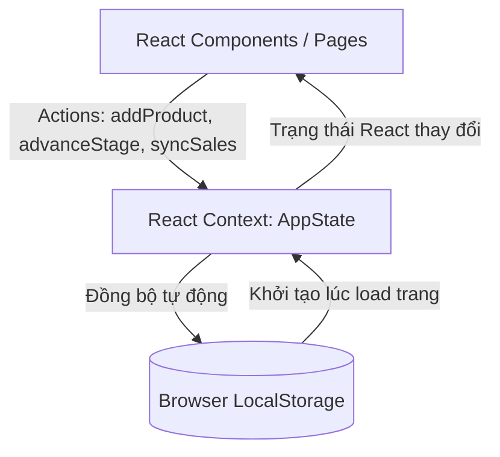

# Kiến trúc ứng dụng - Silence Production Dashboard

Tài liệu này mô tả chi tiết kiến trúc client-side, cách quản lý dữ liệu (state) và luồng hoạt động của ứng dụng **Silence Production Dashboard**.

---

## 🏗️ Tổng quan Kiến trúc (Vite + React SPA)

Ứng dụng được xây dựng dưới dạng Single Page Application (SPA) chạy hoàn toàn trên trình duyệt của người dùng. Để phục vụ việc thử nghiệm nhanh và lưu trữ bền vững, chúng ta kết hợp **React Context API** và **HTML5 LocalStorage**.



---

## 🧩 Cấu trúc các thành phần (Component Hierarchy)

Ứng dụng tuân thủ mô hình phân cấp component chặt chẽ nhằm tối ưu hóa khả năng tái sử dụng:

```text
src/
├── main.tsx                # Điểm khởi đầu (Entrypoint)
├── App.tsx                 # Quản lý routing và Layout chính
├── context/
│   └── AppContext.tsx      # Quản lý State tập trung (Context + Reducer)
├── components/
│   ├── Sidebar.tsx         # Thanh điều hướng trái (240px)
│   ├── Header.tsx          # Tiêu đề trang, nút Sync trạng thái
│   └── DashboardCharts.tsx # Biểu đồ SVG/Recharts tùy chỉnh
└── pages/
    ├── Dashboard.tsx       # Phân tích tài chính, thống kê KPI
    ├── Production.tsx      # Bảng điều khiển tiến độ sản xuất 5 bước
    ├── Expenses.tsx        # Nhập chi phí nhanh & giả lập đồng bộ đơn hàng
    ├── Inventory.tsx       # Quản lý tồn kho khả dụng/đang sản xuất/đã bán
    └── Products.tsx        # Quản lý danh mục sản phẩm (SKU)
```

---

## 💾 Quản lý trạng thái (State Management)

Toàn bộ dữ liệu của hệ thống được quản lý thông qua `AppContext` chứa các tập dữ liệu sau:
- **`products`**: Danh sách sản phẩm khả dụng trong hệ thống.
- **`productionBatches`**: Danh sách các lô hàng đang hoặc đã sản xuất, kèm theo trạng thái công đoạn hiện tại.
- **`expenses`**: Các khoản chi phí vận hành nhập thêm.
- **`sales`**: Các đơn hàng bán (được tạo thủ công hoặc đồng bộ từ kênh bán lẻ).

### Quy trình cập nhật dữ liệu (Data Update Flow)
1. Người dùng thực hiện một hành động (ví dụ: chuyển trạng thái lô hàng sản xuất sang "Đóng gói & Nhập kho").
2. Component gọi hàm dispatch của Context: `advanceBatchStage(batchId)`.
3. State của lô hàng chuyển sang trạng thái mới. Đồng thời, số lượng tồn kho `Available` của sản phẩm đó được cộng thêm.
4. Trạng thái mới được ghi đè vào `LocalStorage`.
5. React render lại giao diện, các biểu đồ tự động cập nhật số liệu mới nhất.
6. Tự động cập nhật kéo đơn hàng tạo từ sàn Thương mại điện từ về 
7. tăng số lượng cập nhật tồn kho lên 3000 SKU cùng lúc
8. Tính toán lãi lỗ dựa trên chi phí và doanh thu theo từng, ngày, tuần, tháng
9.
