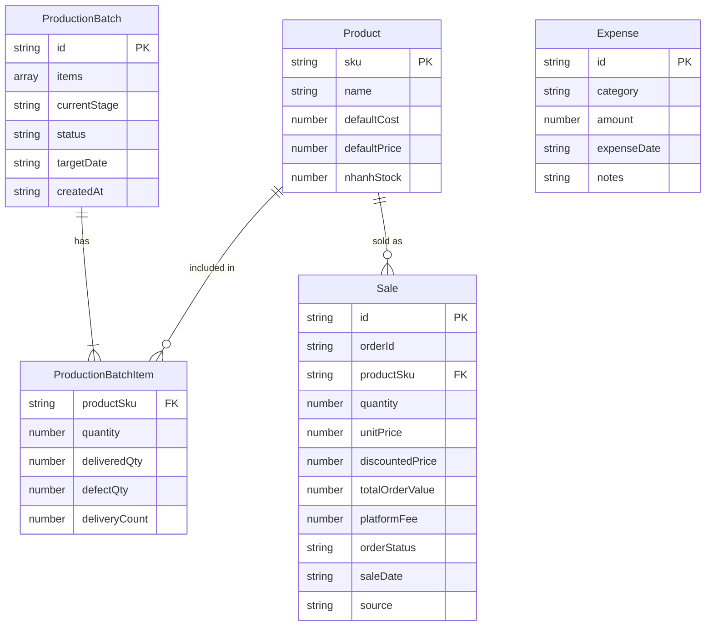

# Thiết kế Cơ sở Dữ liệu - Silence Production Dashboard

Hệ thống sử dụng **kiến trúc lưu trữ kép (Dual-Write)**:
- **LocalStorage** của trình duyệt — lưu cache cục bộ, khởi tạo nhanh khi load trang, hoạt động offline.
- **Firebase Realtime Database** — lưu trữ đám mây, đồng bộ realtime giữa tất cả các thiết bị đang mở app.

Khi dữ liệu thay đổi → ghi đồng thời vào cả LocalStorage và Firebase. Khi Firebase nhận thay đổi từ thiết bị khác → tự động cập nhật React state và LocalStorage trên thiết bị hiện tại.

---

## 📊 Sơ đồ thực thể quan hệ (Logical ERD)



---

## 🗄️ Cấu trúc chi tiết các trường (Schema details)

### 1. Bảng `products` (Danh mục sản phẩm)
Key lưu trữ: `silence_prod_products`

| Tên trường | Kiểu dữ liệu | Mô tả | Ví dụ |
| :--- | :--- | :--- | :--- |
| `sku` | `string` (PK) | Mã định danh duy nhất (chữ in hoa). | `"TS-SILENCE-01"` |
| `name` | `string` | Tên sản phẩm hiển thị. | `"Áo thun Silence Classic"` |
| `defaultCost` | `number` | Chi phí sản xuất định mức trên 1 sản phẩm. | `55000` |
| `defaultPrice` | `number` | Giá bán lẻ đề xuất trên 1 sản phẩm. | `150000` |
| `nhanhStock` | `number` (Optional) | Tồn kho đồng bộ từ Nhanh.vn (hoặc import thủ công ở chế độ Sandbox). | `120` |

### 2. Bảng `production_batches` (Lô sản xuất)
Key lưu trữ: `silence_prod_batches`

| Tên trường | Kiểu dữ liệu | Mô tả | Ví dụ |
| :--- | :--- | :--- | :--- |
| `id` | `string` (PK) | Mã lô sản xuất tự động sinh. | `"LOT-20260617-0001"` |
| `items` | `array` | Danh sách sản phẩm gia công trong lô hàng (chứa SKU, Số lượng đặt, Số lượng đã trả, Số lượng lỗi, Số lần giao). | `[{"productSku": "TS-SILENCE-01", "quantity": 100, "deliveredQty": 80, "defectQty": 5, "deliveryCount": 2}]` |
| `currentStage` | `string` | Công đoạn hiện tại (`ordered`, `paid`, `shipping`, `producing`, `delivered`). | `"producing"` |
| `status` | `string` | Trạng thái (`running`, `completed`). | `"running"` |
| `targetDate` | `string` | Ngày dự kiến hoàn thành sản xuất. | `"2026-06-25"` |
| `createdAt` | `string` | Ngày khởi tạo lô hàng. | `"2026-06-17"` |

#### Chi tiết đối tượng trong mảng `items` (ProductionBatchItem):
- `productSku` (string): Mã SKU sản phẩm.
- `quantity` (number): Số lượng sản phẩm yêu cầu sản xuất trong lệnh.
- `deliveredQty` (number, optional): Số lượng sản phẩm thực tế đã nhận bàn giao từ xưởng gia công.
- `defectQty` (number, optional): Số lượng sản phẩm bị lỗi trong số sản phẩm đã nhận bàn giao.
- `deliveryCount` (number, optional): Số lần bàn giao hàng của lô sản phẩm này từ xưởng.


### 3. Bảng `sales` (Đơn hàng đã bán)
Key lưu trữ: `silence_prod_sales`

| Tên trường | Kiểu dữ liệu | Mô tả | Ví dụ |
| :--- | :--- | :--- | :--- |
| `id` | `string` (PK) | Mã giao dịch bán hàng của từng dòng sản phẩm. | `"100293"` hoặc `"100293-1"` |
| `orderId` | `string` (Optional) | ID đơn hàng gốc từ Nhanh.vn (nhiều sản phẩm chung 1 đơn sẽ chung `orderId`). | `"100293"` |
| `productSku` | `string` (FK) | Liên kết với `products.sku`. | `"TS-SILENCE-01"` |
| `quantity` | `number` | Số lượng sản phẩm bán ra. | `5` |
| `unitPrice` | `number` | Giá bán gốc tại thời điểm giao dịch. | `150000` |
| `discountedPrice` | `number` (Optional) | Giá bán sau khi chiết khấu. | `145000` |
| `totalOrderValue` | `number` (Optional) | Tổng giá trị thực thu của cả đơn hàng (bao gồm mọi sản phẩm). | `725000` |
| `platformFee` | `number` (Optional) | Phí sàn của đơn hàng (thuế/phí Shopee, TikTok...). | `45000` |
| `orderStatus` | `string` (Optional) | Trạng thái đơn hàng từ Nhanh.vn. | `"success"` |
| `saleDate` | `string` | Ngày bán hàng. | `"2026-06-17"` |
| `source` | `string` | Nguồn đơn hàng (`manual`, `nhanh_vn`, `shopee`, `tiktok`, `offline`). | `"shopee"` |

### 4. Bảng `expenses` (Chi phí vận hành ngoài sản xuất)
Key lưu trữ: `silence_prod_expenses`

| Tên trường | Kiểu dữ liệu | Mô tả | Ví dụ |
| :--- | :--- | :--- | :--- |
| `id` | `string` (PK) | Mã chi phí phát sinh. | `"EXP-20260617-01"` |
| `category` | `string` | Nhóm chi phí (`labor`, `rent`, `ads`, `shipping`, `material`, `other`). | `"ads"` |
| `amount` | `number` | Số tiền chi trả. | `500000` |
| `expenseDate` | `string` | Ngày chi trả. | `"2026-06-17"` |
| `notes` | `string` | Nội dung mô tả chi tiết. | `"Chi chạy quảng cáo Facebook tháng 6"` |

### 5. Bảng `actual_revenues` (Tiền thu thực tế)
Key lưu trữ LocalStorage: `silence_actual_revenues`
Đường dẫn Firebase: `actualRevenues`

| Tên trường | Kiểu dữ liệu | Mô tả | Ví dụ |
| :--- | :--- | :--- | :--- |
| `id` | `string` (PK) | Mã khoản thu tự động sinh. | `"REV-20260718-AF21"` |
| `amount` | `number` | Số tiền thu được (VND). | `12500000` |
| `source` | `string` | Nguồn tiền thu (`shopee`, `tiktok`, `offline`, `bank_transfer`, `cash`, `other`). | `"bank_transfer"` |
| `receivedDate` | `string` | Ngày thực tế nhận được tiền. | `"2026-07-18"` |
| `notes` | `string` | Ghi chú cụ thể. | `"Shopee đối soát đợt 1 tháng 7"` |

### 6. Bảng `users` (Danh sách người dùng và tài khoản)
Key lưu trữ LocalStorage: `silence_prod_users`
Đường dẫn Firebase: `users`

| Tên trường | Kiểu dữ liệu | Mô tả | Ví dụ |
| :--- | :--- | :--- | :--- |
| `username` | `string` (PK) | Tên đăng nhập (viết thường, không dấu). | `"admin"` |
| `password` | `string` | Mật khẩu tài khoản (dạng mã hóa cơ bản/plain text). | `"123456"` |
| `name` | `string` | Tên hiển thị của người dùng. | `"Thái Hồng"` |
| `role` | `string` | Vai trò hệ thống (`admin`, `production`, `finance`, `warehouse`). | `"admin"` |
| `allowedPages` | `array` | Danh sách các trang được phép truy cập. | `["dashboard", "production", "inventory"]` |

### 7. Bảng `action_logs` (Nhật ký thao tác hệ thống)
Key lưu trữ LocalStorage: `silence_action_logs`
Đường dẫn Firebase: `actionLogs`

| Tên trường | Kiểu dữ liệu | Mô tả | Ví dụ |
| :--- | :--- | :--- | :--- |
| `id` | `string` (PK) | Mã log tự động sinh. | `"LOG-20260718-HJK9"` |
| `timestamp` | `string` | Thời gian ghi nhận thao tác (ISO format). | `"2026-07-18T13:10:00Z"` |
| `username` | `string` | Tên tài khoản thực hiện. | `"admin"` |
| `userDisplayName` | `string` | Tên hiển thị người dùng. | `"Thái Hồng"` |
| `action` | `string` | Hành động thực hiện. | `"Đẩy dữ liệu lên Cloud"` |
| `details` | `string` | Chi tiết thao tác. | `"Đã đẩy toàn bộ dữ liệu lên Firebase Cloud thành công."` |
| `category` | `string` | Nhóm thao tác (`auth`, `product`, `production`, `sale`, `expense`, `system`, `user_management`, `sync`). | `"sync"` |

---

## ☁️ Ánh xạ lưu trữ Firebase Realtime Database

Khi cấu hình Firebase Cloud Sync, toàn bộ các bảng trên được ánh xạ thành các node cấp một tương ứng dưới gốc của Realtime Database như sau:

```json
{
  "products": [ ... ],
  "productionBatches": [ ... ],
  "sales": [ ... ],
  "expenses": [ ... ],
  "actualRevenues": [ ... ],
  "users": [ ... ],
  "actionLogs": [ ... ]
}
```


