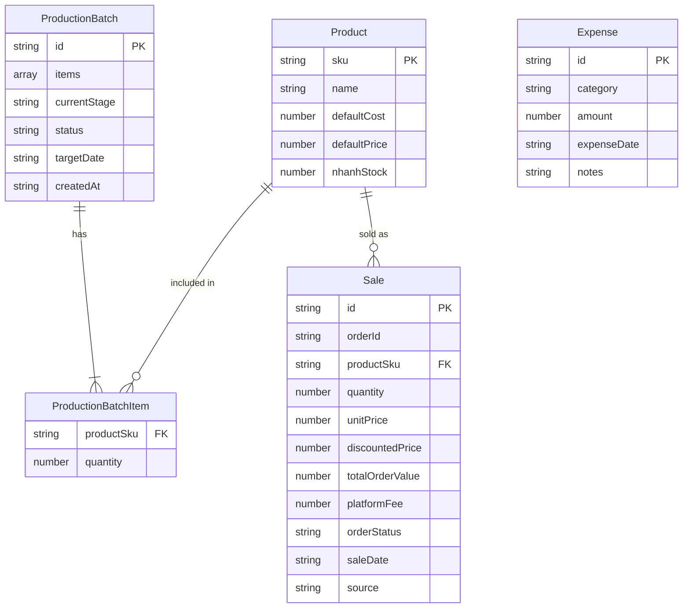

# Thiết kế Cơ sở Dữ liệu - Silence Production Dashboard

Hệ thống sử dụng cơ chế lưu trữ cục bộ **LocalStorage** của trình duyệt để lưu trữ các bảng dữ liệu dưới dạng JSON. Dưới đây là đặc tả cấu trúc của các bảng.

---

## 📊 Sơ đồ thực thể quan hệ (Logical ERD)

---

## 🗄️ Cấu trúc chi tiết các trường (Schema details)

### 1. Bảng `products` (Danh mục sản phẩm)
Key lưu trữ: `silence_prod_products`

| Tên trường | Kiểu dữ liệu | Mô tả | Ví dụ |
| :--- | :--- | :--- | :--- |
| `sku` | `string` (PK) | Mã định danh duy nhất (chữ in hoa). | `"TS-SILENCE-01"` |
| `name` | `string` | Tên sản phẩm hiển thị. | `"Áo thun Silence Classic"` |
| `defaultCost` | `number` | Chi phí sản xuất định mức trên 1 sản phẩm. | `55000` |
| `defaultPrice` | `number` | Giá bán lẻ đề xuất trên 1 sản phẩm. | `150000` |
| `nhanhStock` | `number` (Optional) | Tồn kho đồng bộ từ Nhanh.vn (hoặc import thủ công ở chế độ Sandbox). | `120` |

### 2. Bảng `production_batches` (Lô sản xuất)
Key lưu trữ: `silence_prod_batches`

| Tên trường | Kiểu dữ liệu | Mô tả | Ví dụ |
| :--- | :--- | :--- | :--- |
| `id` | `string` (PK) | Mã lô sản xuất tự động sinh. | `"LOT-20260617-0001"` |
| `items` | `array` | Danh sách sản phẩm gia công trong lô hàng (chứa SKU & Số lượng). | `[{"productSku": "TS-SILENCE-01", "quantity": 100}]` |
| `currentStage` | `string` | Công đoạn hiện tại (`ordered`, `paid`, `shipping`, `producing`, `delivered`). | `"producing"` |
| `status` | `string` | Trạng thái (`running`, `completed`). | `"running"` |
| `targetDate` | `string` | Ngày dự kiến hoàn thành sản xuất. | `"2026-06-25"` |
| `createdAt` | `string` | Ngày khởi tạo lô hàng. | `"2026-06-17"` |

### 3. Bảng `sales` (Đơn hàng đã bán)
Key lưu trữ: `silence_prod_sales`

| Tên trường | Kiểu dữ liệu | Mô tả | Ví dụ |
| :--- | :--- | :--- | :--- |
| `id` | `string` (PK) | Mã giao dịch bán hàng của từng dòng sản phẩm. | `"100293"` hoặc `"100293-1"` |
| `orderId` | `string` (Optional) | ID đơn hàng gốc từ Nhanh.vn (nhiều sản phẩm chung 1 đơn sẽ chung `orderId`). | `"100293"` |
| `productSku` | `string` (FK) | Liên kết với `products.sku`. | `"TS-SILENCE-01"` |
| `quantity` | `number` | Số lượng sản phẩm bán ra. | `5` |
| `unitPrice` | `number` | Giá bán gốc tại thời điểm giao dịch. | `150000` |
| `discountedPrice` | `number` (Optional) | Giá bán sau khi chiết khấu. | `145000` |
| `totalOrderValue` | `number` (Optional) | Tổng giá trị thực thu của cả đơn hàng (bao gồm mọi sản phẩm). | `725000` |
| `platformFee` | `number` (Optional) | Phí sàn của đơn hàng (thuế/phí Shopee, TikTok...). | `45000` |
| `orderStatus` | `string` (Optional) | Trạng thái đơn hàng từ Nhanh.vn. | `"success"` |
| `saleDate` | `string` | Ngày bán hàng. | `"2026-06-17"` |
| `source` | `string` | Nguồn đơn hàng (`manual`, `nhanh_vn`, `shopee`, `tiktok`, `offline`). | `"shopee"` |

### 4. Bảng `expenses` (Chi phí vận hành ngoài sản xuất)
Key lưu trữ: `silence_prod_expenses`

| Tên trường | Kiểu dữ liệu | Mô tả | Ví dụ |
| :--- | :--- | :--- | :--- |
| `id` | `string` (PK) | Mã chi phí phát sinh. | `"EXP-20260617-01"` |
| `category` | `string` | Nhóm chi phí (`labor`, `rent`, `ads`, `shipping`, `material`, `other`). | `"ads"` |
| `amount` | `number` | Số tiền chi trả. | `500000` |
| `expenseDate` | `string` | Ngày chi trả. | `"2026-06-17"` |
| `notes` | `string` | Nội dung mô tả chi tiết. | `"Chi chạy quảng cáo Facebook tháng 6"` |

